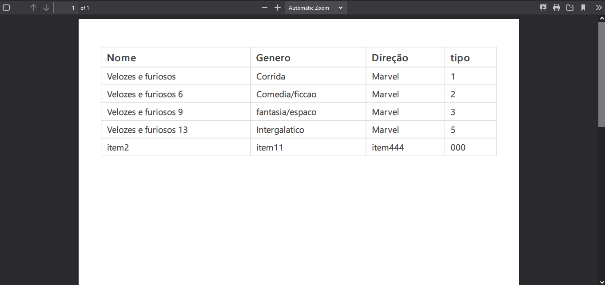
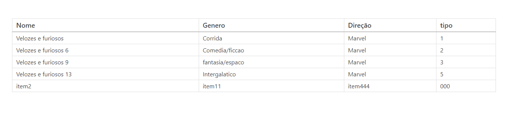

  
  
  
  
  

<h3 align="center">Conversor de CSV para HTML e PDF</h3>

Projeto da formação NodeJs, um conversor de CSV para PDF e HTML.
   

### Introdução        
Projeto realizado a partir da formação nodejs cujo objetivo é um sistema de conversão de CSV para arquivos HTML e PDF. Para usá-lo é preciso instalar a bibliotecas no 'package.json'(npm install) e seguir o arquivo 'example.js' para usá-lo.

### Capturas de telas
Arquivo PDF gerado. O estilo foi adicionado diretamente no arquivo de modelo em 'src/models/table.ejs'.

Arquivo HTML gerado

